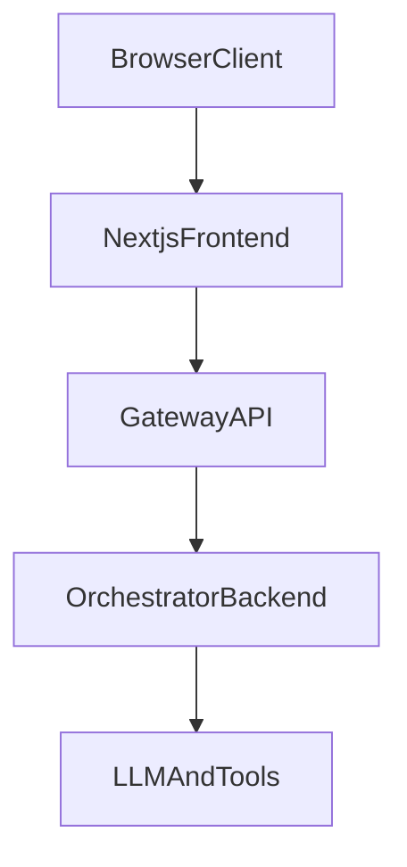

# layer-gateway-api-v1

FastAPI gateway that decouples Next.js from AI orchestration.

The gateway is the trust and transport boundary:
- validates auth at the edge
- normalizes and validates chat requests
- generates/propagates request tracing IDs
- calls orchestrator backend with timeout/retry
- returns a stable response contract to frontend (JSON or SSE)

## Architecture



## Project Structure

```text
app/
  core/
    config.py
    logging.py
  middleware/
    auth.py
    request_context.py
  routes/
    chat.py
    health.py
  schemas/
    chat_request.py
    chat_response.py
    orchestrator.py
  services/
    orchestrator_client.py
tests/
docs/
  plan.md
  design.md
```

## Quick Start

### 1) Create environment and install

```bash
python3.11 -m venv .venv
source .venv/bin/activate
pip install -e ".[dev]"
```

### 2) Configure environment

Create a `.env` file (optional). Defaults are in `app/core/config.py`.

Example:

```env
APP_NAME=layer-gateway-api-v1
ENV=dev
ORCHESTRATOR_BASE_URL=http://localhost:8080
ORCHESTRATOR_CHAT_PATH=/v1/orchestrator/chat
ORCHESTRATOR_TIMEOUT_MS=15000
ORCHESTRATOR_RETRY_MAX_ATTEMPTS=2
AUTH_MODE=stub
AUTH_STUB_USER_ID=user_001
AUTH_STUB_TENANT_ID=tenant_01
CHAT_MESSAGE_MAX_LENGTH=4000
```

### 3) Run server

```bash
uvicorn app.main:app --host 0.0.0.0 --port 8010 --reload
```

### 4) Run tests

```bash
pytest
```

## API

### Health

`GET /health`

curl:

```bash
curl -sS http://localhost:8010/health
```

Response:

```json
{
  "status": "ok"
}
```

### Chat (non-stream)

`POST /api/chat`

Headers:
- `Authorization: Bearer <token>` (required)
- `X-Request-Id` (optional; generated if missing)
- `X-Trace-Id` (optional; generated if missing)

curl:

```bash
curl -sS http://localhost:8010/api/chat \
  -H "Authorization: Bearer demo-token" \
  -H "Content-Type: application/json" \
  -H "X-Request-Id: req_demo_001" \
  -H "X-Trace-Id: trace_demo_001" \
  -d '{
    "session_id": "sess_123",
    "conversation_id": "conv_456",
    "message": "What is the return policy?",
    "metadata": {
      "page": "/support",
      "user_agent": "curl"
    }
  }'
```

Request:

```json
{
  "session_id": "sess_123",
  "conversation_id": "conv_456",
  "message": "What is the return policy?",
  "client_timestamp": "2026-04-22T10:00:00Z",
  "metadata": {
    "page": "/support",
    "user_agent": "browser info"
  }
}
```

Success response:

```json
{
  "status": "success",
  "session_id": "sess_123",
  "request_id": "req_abc123",
  "trace_id": "trace_xyz789",
  "answer": "You can return items within 30 days...",
  "citations": [],
  "usage": {
    "input_tokens": 120,
    "output_tokens": 240
  },
  "error": null
}
```

### Chat (SSE stream)

Use either:
- query flag: `POST /api/chat?stream=true`, or
- header: `Accept: text/event-stream`

curl:

```bash
curl -N http://localhost:8010/api/chat?stream=true \
  -H "Authorization: Bearer demo-token" \
  -H "Content-Type: application/json" \
  -H "Accept: text/event-stream" \
  -d '{
    "session_id": "sess_123",
    "conversation_id": "conv_456",
    "message": "Stream a short answer",
    "metadata": {
      "page": "/support",
      "user_agent": "curl"
    }
  }'
```

Event contract:
- `meta`
- `token`
- `done`
- `error`

Example stream:

```text
event: meta
data: {"request_id":"req_abc123","trace_id":"trace_xyz789","session_id":"sess_123"}

event: token
data: {"text":"Hello"}

event: token
data: {"text":" world"}

event: done
data: {"status":"success"}
```

## Notes

- Current auth is a stub middleware that validates bearer shape and injects trusted context from config.
- Replace stub auth with real JWT/IdP verification for production.
- Orchestrator is expected to expose `POST /v1/orchestrator/chat`.

## Docs

- Implementation plan: `docs/plan.md`
- System design: `docs/design.md`
