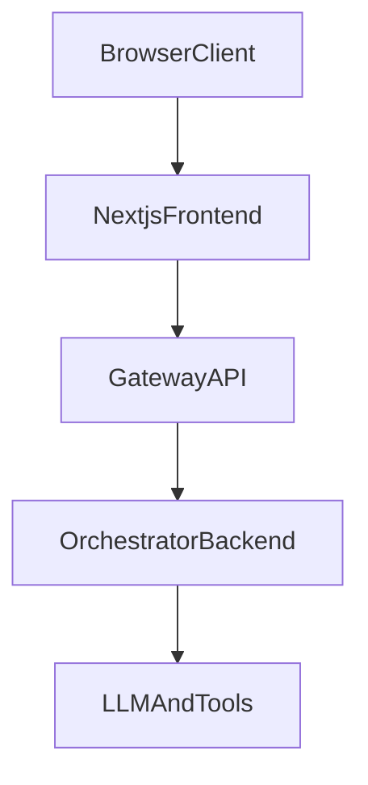

# layer-gateway-api-v1

FastAPI gateway that decouples Next.js from AI orchestration.

The gateway is the trust and transport boundary:
- validates auth at the edge
- normalizes and validates chat requests
- generates/propagates request tracing IDs
- calls orchestrator backend with timeout/retry
- returns a stable response contract to frontend (JSON or SSE)

## Architecture



## Project Structure

```text
app/
  core/
    config.py
    logging.py
    metrics.py
  middleware/
    access_log.py
    auth.py
    inflight.py
    request_context.py
  routes/
    chat.py
    feedback.py
    health.py
    metrics.py
  schemas/
    chat_request.py
    chat_response.py
    feedback.py
    orchestrator.py
  services/
    orchestrator_call_context.py
    orchestrator_client.py
tests/
.github/workflows/
Dockerfile
docker-compose.yml
docs/
  plan.md
  design.md
```

## Quick Start

### 1) Create environment and install

```bash
python3.11 -m venv .venv
source .venv/bin/activate
pip install -e ".[dev]"
```

### 2) Configure environment

Copy the template and edit as needed:

```bash
cp .env.example .env
```

Defaults also live in [`app/core/config.py`](app/core/config.py). `.env.example` documents all variables, including `ORCHESTRATOR_CONTRACT` (`gateway_json` vs `flat_headers`), and auth:

- **Supabase** (recommended): set **`SUPABASE_URL`** and **`SUPABASE_ANON_KEY`**. Protected routes verify the bearer with `supabase.auth.get_user` and load **`profiles`** for roles/team/group.
- **JWKS fallback** (no Supabase): set **`AUTH_JWT_ISSUER`**, **`AUTH_JWT_AUDIENCE`**, and **`AUTH_JWT_JWKS_URL`** from your OIDC provider. Optional **`AUTH_JWT_CLAIM_*`** map claims into gateway `user_id`, `tenant_id`, `roles`, `groups`, and `teams`.

Example fragment (see `.env.example` for the full file):

```env
ORCHESTRATOR_BASE_URL=http://192.168.86.179:30184
ORCHESTRATOR_CHAT_PATH=/orchestrator/answer
ORCHESTRATOR_FEEDBACK_PATH=/feedback
ORCHESTRATOR_CONTRACT=flat_headers
SUPABASE_URL=https://your-project.supabase.co
SUPABASE_ANON_KEY=your-anon-key
FRONTEND_URL=http://localhost:3000
```

Legacy nested JSON orchestrator (default in code when unset):

```env
ORCHESTRATOR_BASE_URL=http://192.168.86.179:30184
ORCHESTRATOR_CHAT_PATH=/v1/orchestrator/answer
ORCHESTRATOR_CONTRACT=gateway_json
```

### 3) Run server

```bash
uvicorn app.main:app --host 0.0.0.0 --port 8000 --reload
```

### 4) Run tests

```bash
pytest
```

### Docker

Build and run locally (port 8000; use `.env` from `cp .env.example .env`):

```bash
docker build -t layer-gateway-api-v1 .
docker run -p 8000:8000 --env-file .env layer-gateway-api-v1
```

Or with Compose:

```bash
docker compose up --build
```

Run an image published from CI (replace `YOUR_DOCKERHUB_USER` with your Docker Hub username or org):

```bash
docker pull YOUR_DOCKERHUB_USER/layer-gateway-api-v1:latest
docker run -p 8000:8000 --env-file .env YOUR_DOCKERHUB_USER/layer-gateway-api-v1:latest
```

**Docker Hub:** pushes to `main`, tags matching `v*`, and manual **workflow_dispatch** build and push the image (see [`.github/workflows/docker-push.yml`](.github/workflows/docker-push.yml)). Add repository secrets **Settings → Secrets and variables → Actions**:

| Secret | Description |
| --- | --- |
| `DOCKERHUB_USERNAME` | Docker Hub username or organization |
| `DOCKERHUB_TOKEN` | Docker Hub access token (recommended) |

Images: `YOUR_DOCKERHUB_USER/layer-gateway-api-v1:latest`, `YOUR_DOCKERHUB_USER/layer-gateway-api-v1:<version-or-short-sha>`, and `YOUR_DOCKERHUB_USER/layer-gateway-api-v1:<full-git-sha>`.

**CI:** [`.github/workflows/ci.yml`](.github/workflows/ci.yml) runs `pytest` on pushes and pull requests to `main`.

## API

### Health and readiness

`GET /health` — liveness (process up). No auth.

`GET /ready` — readiness (orchestrator probe). No auth. Returns **503** if `GET {ORCHESTRATOR_BASE_URL}{ORCHESTRATOR_READINESS_PATH}` is not HTTP 2xx within `ORCHESTRATOR_READINESS_TIMEOUT_MS`. Set `ORCHESTRATOR_READINESS_PROBE_ENABLED=false` to skip the probe (e.g. local dev without orchestrator).

curl:

```bash
curl -sS http://localhost:8000/health
curl -sS http://localhost:8000/ready
```

Health response:

```json
{
  "status": "ok"
}
```

Ready response (probe succeeded):

```json
{
  "status": "ready",
  "orchestrator": "ok"
}
```

### Chat (non-stream)

`POST /v1/chat`

Headers:
- `Authorization: Bearer <token>` (required)
- `X-Session-Id` (optional; 3–128 chars; if omitted the gateway mints `sess_…` and returns it in responses — **do not send `session_id` in JSON**; it is rejected)
- `X-Request-Id` (optional; generated if missing)
- `X-Trace-Id` (optional; generated if missing)

curl:

```bash
curl -sS http://localhost:8000/v1/chat \
  -H "Authorization: Bearer <access_token>" \
  -H "Content-Type: application/json" \
  -H "X-Session-Id: sess_123" \
  -H "X-Request-Id: req_demo_001" \
  -H "X-Trace-Id: trace_demo_001" \
  -d '{
    "conversation_id": "conv_456",
    "message": "What is the return policy?",
    "metadata": {
      "page": "/support",
      "user_agent": "curl"
    }
  }'
```

Request:

```json
{
  "conversation_id": "conv_456",
  "message": "What is the return policy?",
  "client_timestamp": "2026-04-22T10:00:00Z",
  "metadata": {
    "page": "/support",
    "user_agent": "browser info"
  }
}
```

`request_id` / `trace_id` are always taken from headers (or generated by the gateway); they must not appear in the JSON body (`ChatRequest` uses `extra="forbid"`).

Success response:

```json
{
  "status": "success",
  "session_id": "sess_123",
  "request_id": "req_abc123",
  "trace_id": "trace_xyz789",
  "answer": "You can return items within 30 days...",
  "citations": [],
  "follow_up_questions": [
    "What is the return window for opened items?",
    "Do sale items qualify for returns?"
  ],
  "usage": {
    "input_tokens": 120,
    "output_tokens": 240
  }
}
```

On success the **`error`** field is omitted (it appears only when present).
### Chat (SSE stream)

Use either:
- header: `Accept: text/event-stream`
- JSON body: `"stream": true`

curl:

```bash
curl -N http://localhost:8000/v1/chat \
  -H "Authorization: Bearer <access_token>" \
  -H "Content-Type: application/json" \
  -H "Accept: text/event-stream" \
  -H "X-Session-Id: sess_123" \
  -d '{
    "conversation_id": "conv_456",
    "message": "Stream a short answer",
    "metadata": {
      "page": "/support",
      "user_agent": "curl"
    }
  }'
```

Event contract:
- `meta`
- `token`
- `done`
- `error`

Example stream:

```text
event: meta
data: {"request_id":"req_abc123","trace_id":"trace_xyz789","session_id":"sess_123"}

event: token
data: {"text":"Hello"}

event: token
data: {"text":" world"}

event: done
data: {"status":"success","citations":[{"cite_id":1,"source":"profile","text":"..."}],"follow_up_questions":["Follow-up question 1?"]}
```

With `ORCHESTRATOR_CONTRACT=flat_headers`, outbound orchestrator JSON omits `"stream": true` (orchestrator defaults to streaming). The gateway sends `"stream": false` only when the client chose **non-stream JSON** (`POST /v1/chat` without SSE).

**Production streaming rule:** one orchestrator POST per user turn in normal chat. Terminal **JSON envelopes** are mapped once to `rewrite` / `token` / `done` (`used_json_envelope: true`). For **SSE** that already emitted answer chunks (rewrite/token), the gateway **does not** replay with `"stream": false` — see `note: flat_stream_metadata_supplement` only when `streamed_before_done` is 0. `stream_closed` logs include `used_json_envelope`, `metadata_supplement`, and `metadata_supplement_skipped`.

The gateway aggregates upstream RAG events (`citations`, `follow_up_questions`) into the terminal `done` when upstream sends them on separate SSE lines before `done`. A supplemental non-stream call runs only when the stream ended with **no** answer chunks and `done` still lacks metadata keys.

## Observability and limits

### Middleware order (request → route)

Outermost first: **request context** (`X-Request-Id` / `X-Trace-Id`) → **structured access log** (latency, `request_complete` JSON log + Prometheus) → **auth** → **inflight cap** → routes.

### `request_complete` log

Every finished request emits a structured log line via `python-json-logger` with fields such as: `ts`, `level`, `event` (`request_complete`), `service`, `request_id`, `trace_id`, `session_id`, `path`, `method`, `status`, `latency_ms`, optional `ttfb_ms` (first **upstream** SSE token after `meta` for `/v1/chat` streams), `stream`, `backend` (`orchestrator` for `POST /v1/chat`, else `-`).

### Prometheus

`GET /metrics` (no auth) exposes:

- `gateway_requests_total{method,path,status}`
- `gateway_request_latency_ms_bucket` (histogram)
- `gateway_ttfb_ms_bucket` (streaming TTFB, histogram)
- `gateway_inflight_requests` (gauge)
- `gateway_rejected_requests_total{reason}` (e.g. `inflight_limit`)

### Backpressure

`MAX_INFLIGHT_REQUESTS` (default `100`) caps concurrent non-exempt requests; excess clients receive **503**. Probes (`/health`, `/ready`, `/metrics`, `/docs`, `/openapi.json`) bypass the cap.

### Retry safety

Non-stream orchestrator calls use bounded retries; **streaming** orchestrator calls **do not** retry once the upstream stream has started (see `OrchestratorClient.stream_chat`).

### Roadmap (not implemented here)

Circuit breaker per upstream, health-scored routing, static API-key auth, rate limits, queue wait time / max age, graceful shutdown hooks beyond uvicorn defaults, and richer header sanitization — good next steps aligned with production AI gateways.

## Notes

- **Auth:** Supabase (`SUPABASE_URL` + `SUPABASE_ANON_KEY`) verifies bearer tokens and loads `profiles`; without Supabase, JWKS (`AUTH_JWT_*`) verifies OIDC access tokens (see `.env.example`).
- Orchestrator contract is env-driven (`gateway_json` vs `flat_headers`); see README and `app/core/config.py`.

## Docs

- Implementation plan: `docs/plan.md`
- System design: `docs/design.md`
