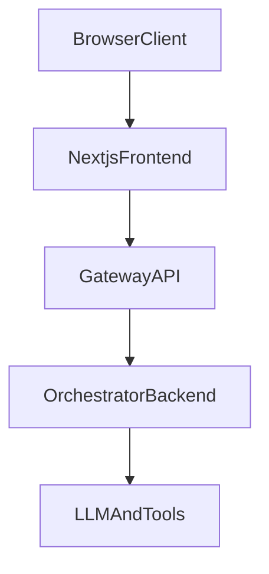

# layer-gateway-api-v1

FastAPI gateway that decouples Next.js from AI orchestration.

The gateway is the trust and transport boundary:
- validates auth at the edge
- normalizes and validates chat requests
- generates/propagates request tracing IDs
- calls orchestrator backend with timeout/retry
- returns a stable response contract to frontend (JSON or SSE)

## Architecture



## Project Structure

```text
app/
  core/
    config.py
    logging.py
  middleware/
    auth.py
    request_context.py
  routes/
    chat.py
    feedback.py
    health.py
  schemas/
    chat_request.py
    chat_response.py
    feedback.py
    orchestrator.py
  services/
    orchestrator_call_context.py
    orchestrator_client.py
tests/
.github/workflows/
Dockerfile
docker-compose.yml
docs/
  plan.md
  design.md
```

## Quick Start

### 1) Create environment and install

```bash
python3.11 -m venv .venv
source .venv/bin/activate
pip install -e ".[dev]"
```

### 2) Configure environment

Copy the template and edit as needed:

```bash
cp .env.example .env
```

Defaults also live in [`app/core/config.py`](app/core/config.py). `.env.example` documents all variables, including `ORCHESTRATOR_CONTRACT` (`gateway_json` vs `flat_headers`) and stub auth fields used as upstream `X-User-*` headers in flat mode.

Example fragment for a header-style orchestrator (see `.env.example` for the full file):

```env
ORCHESTRATOR_BASE_URL=http://192.168.86.179:30184
ORCHESTRATOR_CHAT_PATH=/orchestrator/answer
ORCHESTRATOR_FEEDBACK_PATH=/feedback
ORCHESTRATOR_CONTRACT=flat_headers
AUTH_STUB_USER_ID=taixing
AUTH_STUB_ROLES=hr
AUTH_STUB_GROUPS=engineering
AUTH_STUB_TEAMS=rag-platform
```

Legacy nested JSON orchestrator (default in code when unset):

```env
ORCHESTRATOR_BASE_URL=http://192.168.86.179:30184
ORCHESTRATOR_CHAT_PATH=/v1/orchestrator/chat
ORCHESTRATOR_CONTRACT=gateway_json
```

### 3) Run server

```bash
uvicorn app.main:app --host 0.0.0.0 --port 8000 --reload
```

### 4) Run tests

```bash
pytest
```

### Docker

Build and run locally (port 8000; use `.env` from `cp .env.example .env`):

```bash
docker build -t layer-gateway-api-v1 .
docker run -p 8000:8000 --env-file .env layer-gateway-api-v1
```

Or with Compose:

```bash
docker compose up --build
```

Run an image published from CI (replace `YOUR_DOCKERHUB_USER` with your Docker Hub username or org):

```bash
docker pull YOUR_DOCKERHUB_USER/layer-gateway-api-v1:latest
docker run -p 8000:8000 --env-file .env YOUR_DOCKERHUB_USER/layer-gateway-api-v1:latest
```

**Docker Hub:** pushes to `main`, tags matching `v*`, and manual **workflow_dispatch** build and push the image (see [`.github/workflows/docker-push.yml`](.github/workflows/docker-push.yml)). Add repository secrets **Settings → Secrets and variables → Actions**:

| Secret | Description |
| --- | --- |
| `DOCKERHUB_USERNAME` | Docker Hub username or organization |
| `DOCKERHUB_TOKEN` | Docker Hub access token (recommended) |

Images: `YOUR_DOCKERHUB_USER/layer-gateway-api-v1:latest`, `YOUR_DOCKERHUB_USER/layer-gateway-api-v1:<version-or-short-sha>`, and `YOUR_DOCKERHUB_USER/layer-gateway-api-v1:<full-git-sha>`.

**CI:** [`.github/workflows/ci.yml`](.github/workflows/ci.yml) runs `pytest` on pushes and pull requests to `main`.

## API

### Health

`GET /health`

curl:

```bash
curl -sS http://localhost:8000/health
```

Response:

```json
{
  "status": "ok"
}
```

### Chat (non-stream)

`POST /api/chat`

Headers:
- `Authorization: Bearer <token>` (required)
- `X-Request-Id` (optional; generated if missing)
- `X-Trace-Id` (optional; generated if missing)

curl:

```bash
curl -sS http://localhost:8000/api/chat \
  -H "Authorization: Bearer demo-token" \
  -H "Content-Type: application/json" \
  -H "X-Request-Id: req_demo_001" \
  -H "X-Trace-Id: trace_demo_001" \
  -d '{
    "session_id": "sess_123",
    "conversation_id": "conv_456",
    "message": "What is the return policy?",
    "metadata": {
      "page": "/support",
      "user_agent": "curl"
    }
  }'
```

Request:

```json
{
  "session_id": "sess_123",
  "conversation_id": "conv_456",
  "message": "What is the return policy?",
  "client_timestamp": "2026-04-22T10:00:00Z",
  "metadata": {
    "page": "/support",
    "user_agent": "browser info"
  }
}
```

Success response:

```json
{
  "status": "success",
  "session_id": "sess_123",
  "request_id": "req_abc123",
  "trace_id": "trace_xyz789",
  "answer": "You can return items within 30 days...",
  "citations": [],
  "usage": {
    "input_tokens": 120,
    "output_tokens": 240
  },
  "error": null
}
```

### Chat (SSE stream)

Use either:
- query flag: `POST /api/chat?stream=true`, or
- header: `Accept: text/event-stream`

curl:

```bash
curl -N http://localhost:8000/api/chat?stream=true \
  -H "Authorization: Bearer demo-token" \
  -H "Content-Type: application/json" \
  -H "Accept: text/event-stream" \
  -d '{
    "session_id": "sess_123",
    "conversation_id": "conv_456",
    "message": "Stream a short answer",
    "metadata": {
      "page": "/support",
      "user_agent": "curl"
    }
  }'
```

Event contract:
- `meta`
- `token`
- `done`
- `error`

Example stream:

```text
event: meta
data: {"request_id":"req_abc123","trace_id":"trace_xyz789","session_id":"sess_123"}

event: token
data: {"text":"Hello"}

event: token
data: {"text":" world"}

event: done
data: {"status":"success"}
```

## Notes

- Current auth is a stub middleware that validates bearer shape and injects trusted context from config.
- Replace stub auth with real JWT/IdP verification for production.
- Orchestrator is expected to expose `POST /v1/orchestrator/chat`.

## Docs

- Implementation plan: `docs/plan.md`
- System design: `docs/design.md`
