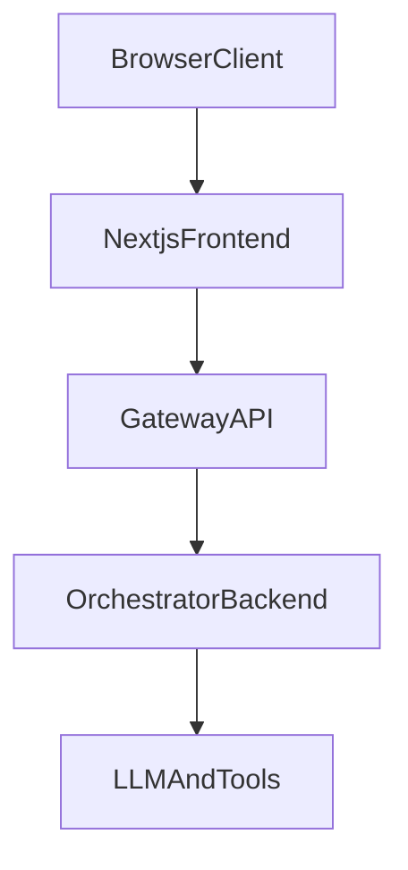

# Gateway Design

## Architecture

## Responsibilities
### Next.js
- Render UI and collect user input.
- Send authenticated requests to gateway.
- Render final or streaming answer.

### Gateway API
- Validate bearer token and build trusted auth context.
- Generate/propagate `request_id`, `trace_id`, and `session_id` (session from `X-Session-Id` header when present, else body, else minted).
- Validate and normalize input payload.
- Call orchestrator with timeout/retry and map errors.
- Return a stable frontend contract.
- Emit structured logs for request lifecycle.

### Orchestrator Backend
- Orchestrate prompts, tools, retrieval, and model routing.
- Return structured answer payload to gateway.

## Middleware pipeline (request order)

Outermost first on the incoming request:

1. **Request context** — `X-Request-Id`, `X-Trace-Id` (or generated); echo on response.
2. **Structured access log** — `request_complete` JSON log + Prometheus observe on completion (for SSE, wraps the body iterator for total latency and client disconnect).
3. **Auth** — bearer stub (production: JWT / API key); does not trust client role headers for upstream.
4. **Inflight limit** — bounded concurrency; **503** when over cap (health/ready/metrics/docs exempt).

## API Contracts

Field-level request/response tables: **[schema.md](./schema.md)**.

### Frontend -> Gateway (`POST /api/chat`)
Request:
- `X-Session-Id` header (optional): session continuity; if omitted the gateway mints `sess_…` (never accept `session_id` in JSON — `extra=forbid`).
- `conversation_id` (optional)
- `message` (required)
- `history` (optional array of `{role, content}` prior turns; forwarded to orchestrator)
- `client_timestamp` (optional)
- `metadata` (optional object)

Headers:
- `Authorization: Bearer <token>`
- `X-Session-Id` (optional, preferred for session continuity)
- `X-Request-Id` (optional)
- `X-Trace-Id` (optional)

### Gateway -> Orchestrator (`POST /v1/orchestrator/chat`)
Body sections:
- `auth`: `user_id`, `tenant_id`, `roles`
- `context`: `session_id`, `conversation_id`, `request_id`, `trace_id`
- `input`: normalized `question` and optional `history`
- `client`: source and metadata

### Gateway -> Frontend
Stable response:
- `status`
- `session_id`
- `request_id`
- `trace_id`
- `answer`
- `citations`
- `follow_up_questions` (from orchestrator / RAG when present)
- `usage`
- `error` (only on failure; omitted on success)

Streaming events:
- `meta`
- `token` (from upstream `answer_delta` / `token`)
- `done` — `data` includes `status`, and when upstream RAG sent them: `citations`, `follow_up_questions` (aggregated from separate upstream SSE events)
- `error`

## Runtime Modules
- `app/main.py`: app creation and lifespan dependencies.
- `app/core/config.py`: environment-driven settings.
- `app/core/logging.py`: structured log helper.
- `app/middleware/request_context.py`: correlation IDs.
- `app/middleware/access_log.py`: `request_complete` logging and histogram updates.
- `app/middleware/inflight.py`: concurrency cap (backpressure).
- `app/middleware/auth.py`: auth guard and context extraction.
- `app/routes/chat.py`: main gateway endpoint and SSE handling.
- `app/routes/health.py`: liveness (`/health`) and readiness (`/ready`) endpoints.
- `app/routes/metrics.py`: Prometheus scrape (`/metrics`).
- `app/core/metrics.py`: metric definitions.
- `app/services/orchestrator_client.py`: orchestrator transport, retry, timeout, mapping.
- `app/schemas/*`: request/response DTO contracts.

## Error Handling
- `400`: bad gateway input or downstream validation issue.
- `401/403`: auth failure.
- `502`: upstream orchestrator error.
- `504`: upstream timeout.

## Logging Fields
Every request log should include:
- `event`
- `request_id`
- `trace_id`
- `session_id` (when available)
- `user_id` (when available)
- `path`
- `status`
- `latency_ms` (when measured)
