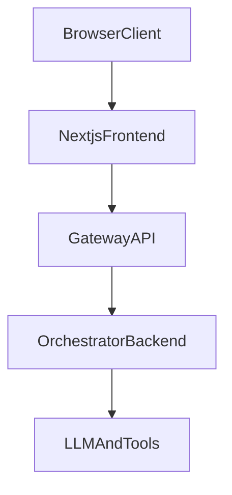

# Gateway Design

## Architecture

## Responsibilities
### Next.js
- Render UI and collect user input.
- Send authenticated requests to gateway.
- Render final or streaming answer.

### Gateway API
- Validate bearer token and build trusted auth context.
- Generate/propagate `request_id`, `trace_id`, and `session_id`.
- Validate and normalize input payload.
- Call orchestrator with timeout/retry and map errors.
- Return a stable frontend contract.
- Emit structured logs for request lifecycle.

### Orchestrator Backend
- Orchestrate prompts, tools, retrieval, and model routing.
- Return structured answer payload to gateway.

## API Contracts
### Frontend -> Gateway (`POST /api/chat`)
Request:
- `session_id` (optional, generated if missing)
- `conversation_id` (optional)
- `message` (required)
- `client_timestamp` (optional)
- `metadata` (optional object)

Headers:
- `Authorization: Bearer <token>`
- `X-Request-Id` (optional)
- `X-Trace-Id` (optional)

### Gateway -> Orchestrator (`POST /v1/orchestrator/chat`)
Body sections:
- `auth`: `user_id`, `tenant_id`, `roles`
- `context`: `session_id`, `conversation_id`, `request_id`, `trace_id`
- `input`: normalized `question`
- `client`: source and metadata

### Gateway -> Frontend
Stable response:
- `status`
- `session_id`
- `request_id`
- `trace_id`
- `answer`
- `citations`
- `usage`
- `error`

Streaming events:
- `meta`
- `token`
- `done`
- `error`

## Runtime Modules
- `app/main.py`: app creation and lifespan dependencies.
- `app/core/config.py`: environment-driven settings.
- `app/core/logging.py`: structured log helper.
- `app/middleware/auth.py`: auth guard and context extraction.
- `app/middleware/request_context.py`: correlation IDs.
- `app/routes/chat.py`: main gateway endpoint and SSE handling.
- `app/routes/health.py`: liveness endpoint.
- `app/services/orchestrator_client.py`: orchestrator transport, retry, timeout, mapping.
- `app/schemas/*`: request/response DTO contracts.

## Error Handling
- `400`: bad gateway input or downstream validation issue.
- `401/403`: auth failure.
- `502`: upstream orchestrator error.
- `504`: upstream timeout.

## Logging Fields
Every request log should include:
- `event`
- `request_id`
- `trace_id`
- `session_id` (when available)
- `user_id` (when available)
- `path`
- `status_code`
- `latency_ms` (when measured)
